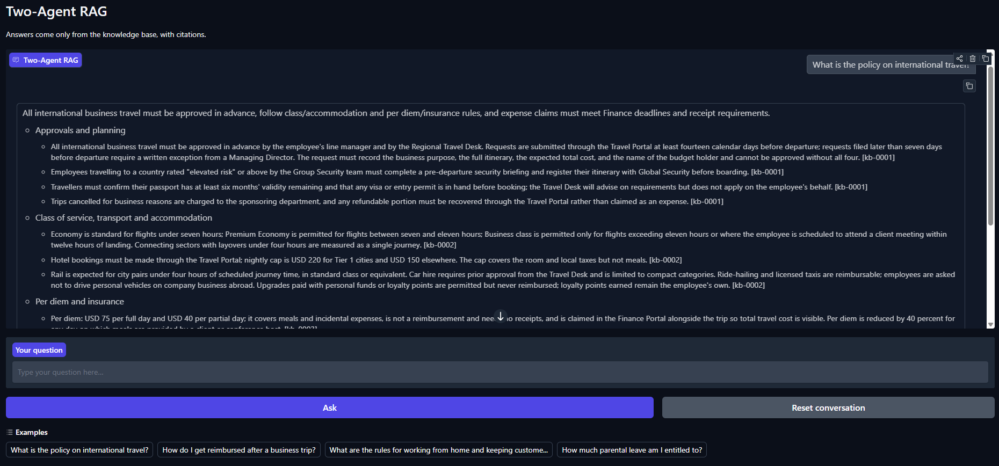
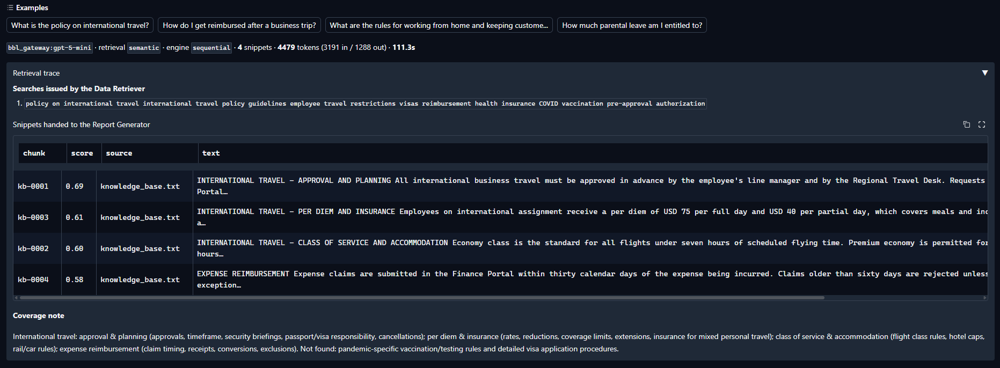
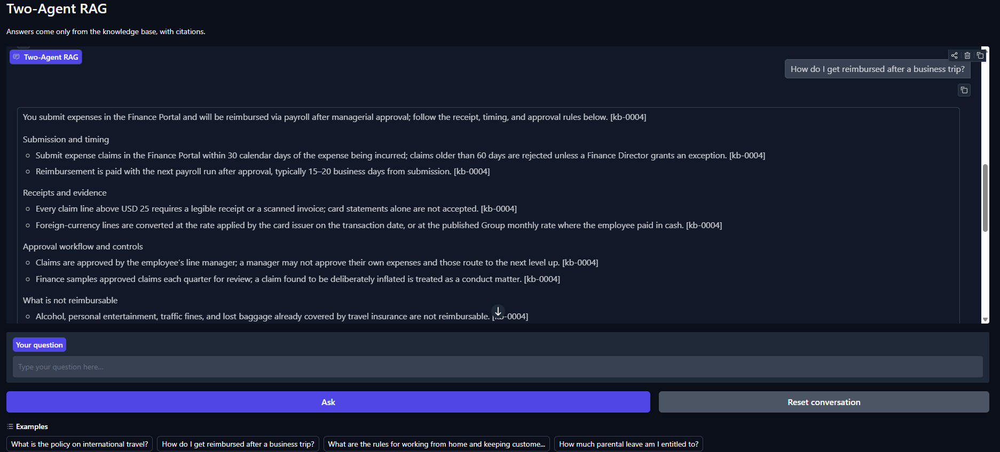
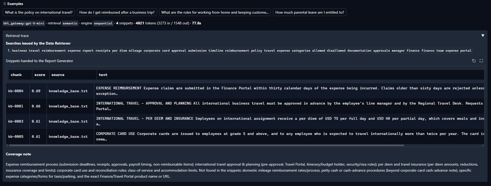
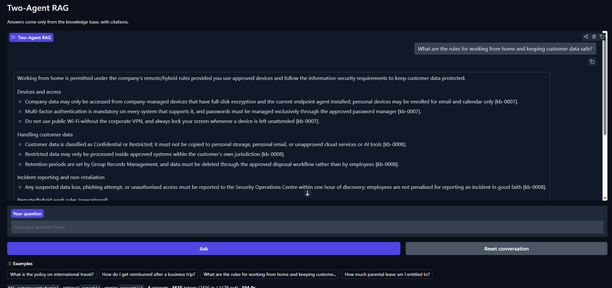
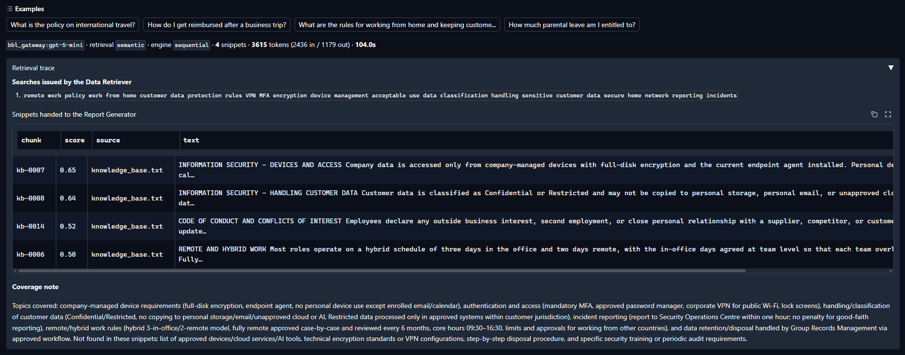

# Two-Agent RAG System

An agentic RAG system with two collaborating agents over a local plain-text knowledge base.

| Agent | Role | Tools | Output |
| --- | --- | --- | --- |
| **Data Retriever** | Retrieval specialist. Reformulates the request into focused searches and never answers it. | `search_knowledge_base` (custom RAG tool) | Raw, deduplicated text snippets |
| **Report Generator** | Writer and synthesiser. Turns the snippets into the final answer. | none | Cited, non-redundant markdown answer |

Orchestration is a sequential [LangGraph](https://langchain-ai.github.io/langgraph/) `StateGraph` workflow: the Data Retriever's output is the only input the Report Generator receives. This is the `main` branch; `framework-free` runs the identical agents through a plain `asyncio` handoff with no framework dependency.

```
                ┌──────────────────┐   snippets    ┌───────────────────┐
 query ────────►│  Data Retriever  │──────────────►│  Report Generator │────► answer
                └────────┬─────────┘               └───────────────────┘
                         │ tool call
                         ▼
              search_knowledge_base
                         │
                  ┌──────┴───────┐
                  │  Retriever   │  BM25 / embeddings / hybrid (RRF)
                  └──────┬───────┘
                         │
                 knowledge_base.txt ──► chunked at load time
```

## Quick start

The project is uv-managed. `uv sync` provisions the interpreter pinned in `.python-version`, creates `.venv`, and installs the exact versions in `uv.lock` plus the project itself:

```bash
uv sync --extra bge-flag
```

```bash
uv run rag-app
```

That opens the web interface on `http://127.0.0.1:7860`, which shows both agents at work: the searches the Data Retriever issued, the snippets it handed over with their relevance scores, its coverage note, and the Report Generator's cited answer. Pass a question instead to stay on the terminal:

```bash
uv run rag-app "What is the policy on international travel?"
```

The default configuration answers with **gpt-5-mini** through the assessment gateway and embeds locally with **BGE-M3**, so it needs `BBL_LLM_API_KEY` in `.env` (see below) and the `bge-flag` extra above. That extra pulls torch, and the first run downloads the BGE-M3 weights into the HuggingFace cache (~4 GB on disk).

### Running it with nothing installed and no key

Every part of the pipeline has an offline stand-in. Plain `uv sync` and these three settings run the real agent loop, the real tool call and real BM25 retrieval, with only the model's wording replaced:

```yaml
llm:        { provider: mock }
embeddings: { provider: null }
retrieval:  { strategy: keyword }
```

`uv run pytest` also passes on a bare `uv sync`, with no extras and no key.

| Command | What it does |
| --- | --- |
| `uv run rag-app` | launch the web interface (default when no query is given) |
| `uv run rag-app "<question>"` | answer one question on the terminal |
| `uv run rag-app --demo` | run every query under `demo.queries` |
| `uv run rag-app --interactive` | ask questions in a loop |
| `uv run rag-app --no-snippets` | hide the retrieval trace |
| `uv run rag-app --reindex` | rebuild the embedding index instead of reusing it |
| `uv run rag-app -c other.yml ...` | use a different config file |
| `uv run pytest` | run the tests |
| `uv run ruff check src tests` | lint |
| `uv run ruff format src tests` | format |

Every command runs inside the locked environment, so there is nothing to activate. `uv run python -m src.main ...` is equivalent to `uv run rag-app ...`.

## Docker

```bash
docker compose up --build
```

The UI is then on `http://localhost:7860`. Put `BBL_LLM_API_KEY` in `.env` first — compose reads it at runtime and it never enters an image layer.

The image is built in two stages, each on the base image suited to its job. The build stage uses `ghcr.io/astral-sh/uv:python3.11-bookworm-slim`, so uv is already present and `uv sync --frozen` reproduces `uv.lock` exactly with no bootstrap step; dependencies resolve in a layer keyed only on `pyproject.toml` and `uv.lock`, so editing code does not reinstall them. The runtime stage is plain `python:3.11-slim-bookworm` and receives only the finished `/app/.venv`, leaving uv, the build caches, and the toolchain behind. It runs as a non-root user.

**The default image leaves out the embedding stack**, which is what keeps it at roughly 510 MB of layers and about a minute to build. It runs BM25 retrieval, which needs no model:

| Service | Retrieval | Layers | Notes |
| --- | --- | --- | --- |
| `rag-app` (default) | `keyword` | ~510 MB | no torch, no downloads |
| `rag-app-semantic` (profile `semantic`) | `semantic` | ~2.0 GB | `--build-arg EXTRAS=bge-flag`; then ~2 GB of BGE-M3 weights into a named volume on first run |

The semantic image installs **CPU-only torch**. On Linux the default PyPI wheel drags in the entire CUDA runtime — 43 `nvidia-*` packages and several GB — which is dead weight in a CPU inference image, so `pyproject.toml` points torch at the PyTorch CPU index for `sys_platform == 'linux'` only. Windows and macOS still resolve the identical `2.13.0` wheels from PyPI, so local development is unaffected. The Linux download drops from multiple GB to 183 MB.

```bash
docker compose --profile semantic up --build
```

Container settings live in their own files rather than in `config.yml`, which stays exactly as it is for local runs. A config may name a base with `extends:`, and its own keys are merged over it, so each override file holds only what actually differs:

| File | Extends | Overrides |
| --- | --- | --- |
| [`config.yml`](config.yml) | — | the local defaults |
| [`config.docker.yml`](config.docker.yml) | `config.yml` | binds `0.0.0.0`, no browser, keyword retrieval, embeddings off |
| [`config.docker.semantic.yml`](config.docker.semantic.yml) | `config.docker.yml` | puts semantic retrieval and BGE-M3 back |

The image selects one with `-c`: `ENTRYPOINT ["rag-app", "-c", "config.docker.yml"]`, which the semantic service replaces with its own. Passing arguments runs the CLI; passing none serves the UI, the same contract as `rag-app`.

```bash
docker run --rm --env-file .env rag-app-assessment:latest "How much parental leave am I entitled to?"
```

## The assessment gateway (gpt-5-mini)

The default `llm.provider` is `bbl_gateway`. Put the key in `.env` and it runs:

```
BBL_LLM_API_KEY=...
```

That endpoint is **not** Azure OpenAI chat-completions. It is the **Responses API** behind an Azure API Management gateway, which differs in four ways that the provider has to handle:

| | Chat Completions | Responses API |
| --- | --- | --- |
| System prompt | a `system` message | top-level `instructions` |
| History | `messages` | flat `input` list of typed items |
| Tool schema | nested `{"function": {...}}` | flat `{"type","name","parameters"}` |
| Tool result | `{"role":"tool","tool_call_id"}` | `{"type":"function_call_output","call_id"}` |

The subtle one: gpt-5-mini is a reasoning model, and a `function_call` replayed **without the `reasoning` item it was emitted with** is rejected outright. `Message.raw_items` carries the provider's own output items back verbatim so the round trip survives, which is why the abstraction has an escape hatch for provider-native payloads.

### Living inside 1000 tokens/minute

The grant is metered, and gpt-5-mini bills hidden reasoning tokens — a three-word answer cost 192 of them at default effort. Four settings keep the prompt for a full query near 3,100–3,250 tokens, and the whole two-agent round trip inside roughly 4,000–4,900:

- `reasoning_effort: low` — reasoning tokens per call drop about 3×
- `parallel_tool_calls: false` and `max_tool_calls: 1` — every parallel search replays its **entire** result into the next request; five searches at once cost 4,302 tokens on a single call
- `top_k` is not exposed in the tool schema, so the model cannot raise the snippet count past the configured budget
- `max_snippet_chars: 1400` — matches `chunking.max_chars`, so a whole policy section reaches the writer rather than half of one

On a 429 the provider honours the gateway's `Retry-After` (60s) rather than an exponential backoff that starts in milliseconds and could never clear a per-minute window.

Note the gateway's `x-ratelimit-limit-tokens` header advertises 250,000/min — that reflects the upstream Azure deployment, not the per-key policy. The 1,000/min figure in the grant email is the one that actually bites.

## Connecting a different model

1. Put the key in `.env` (see `.env.example`) — never in `config.yml`:
   ```
   AZURE_OPENAI_API_KEY=...
   ```
2. Switch the provider in `config.yml`:
   ```yaml
   llm:
     provider: azure_openai
   ```

The `azure_openai` block is pre-filled for the `gpt-5-mini` deployment named in the test brief. Two quirks of that model family are configuration flags rather than code branches: `token_param: max_completion_tokens` and `supports_temperature: false`.

To use any OpenAI-compatible endpoint instead, set `llm.provider: openai` and point `base_url` at it.

## Configuration

Everything is driven by [`config.yml`](config.yml); secrets are read from the environment via the `api_key_env` indirection. Values support `${VAR}` and `${VAR:-default}` expansion, and a file may layer over another with `extends:`. Point at a different file with `-c path/to/config.yml`.

| Section | What it controls |
| --- | --- |
| `logging` | Level, rotating file sink, JSON serialisation |
| `ui` | Web interface title, host, port, public share link, browser auto-open |
| `llm` | Active provider, temperature, token cap, timeout, retries, per-provider connection settings |
| `embeddings` | Provider (`null` disables it), batch size, expected `dimensions`, local-model `options` |
| `embeddings.store` | Where the `.npz` index lives, and whether to reuse or rebuild it |
| `knowledge_base` | Source file and chunking strategy (`paragraph` \| `fixed`), sizes, overlap |
| `retrieval` | Strategy (`keyword` \| `semantic` \| `hybrid`), `top_k`, score floor, BM25 `k1`/`b`, RRF settings |
| `agents` | Agent display names, the Data Retriever's tool-call budget, snippet caps |
| `orchestration` | Workflow engine |
| `demo` | Queries used by `--demo` |

### Retrieval strategies

- **`semantic`** (default) — cosine similarity over BGE-M3 embeddings. Handles paraphrase.
- **`keyword`** — in-memory BM25. No model, no download, exact-term precision.
- **`hybrid`** — weighted reciprocal rank fusion of the two.

BM25 scores are normalised to 0–1, so `retrieval.min_score` acts as a relative floor there. Cosine values are kept raw and gated by `retrieval.semantic.min_similarity` instead. Chunks with no signal at all are dropped before ranking, so an off-topic question correctly returns nothing.

**`min_similarity` is model-specific and must be re-measured whenever the embedding model *or the corpus* changes.** An absolute cosine floor does not transfer. Measured over 13 on-topic and 10 off-topic questions, BGE-M3 puts on-topic best hits at 0.53–0.73 and off-topic best hits at or below 0.44, so `0.48` sits in the middle of a clean gap: every relevant chunk survives and nothing irrelevant leaks. The floor is doing real work — at 0.40 four of the ten off-topic questions leak a chunk, because a 24-section handbook offers more surface for a coincidental match. *"How do I train for a marathon?"* scores 0.44 against **TRAINING AND PROFESSIONAL DEVELOPMENT** on the strength of one shared word. Set it too high instead and retrieval silently starves the Report Generator no matter what `top_k` says.

Why `hybrid` is worth considering: BM25 alone cannot bridge vocabulary. Ask *"How do I get money back after a trip overseas?"* and it misses the reimbursement section entirely — `overseas` appears nowhere in the corpus, and `money` appears once, inside the financial-crime section. BM25 ranks **SICK LEAVE AND MEDICAL ABSENCE** first, on nothing more than incidental function words. Embeddings fix that. Conversely BM25 is sharper on the exact tokens this corpus is full of — `USD 220`, `Tier 1`, `grade 5`, named portals — which embeddings blur.

## Embedding pipeline

Everything runs locally through [`BGEM3EmbeddingProvider`](src/embeddings/bge_m3.py); there is no vector database.

1. `knowledge_base.txt` is chunked (24 paragraph chunks by default — one per policy section, since `max_chars: 1400` clears the longest section at 1,318 characters)
2. Chunks are embedded in batches to **1024-dim** dense vectors. Encoding is blocking work, so it runs in a worker thread behind a lock — one in-process model must not be entered concurrently
3. Vectors are written verbatim to `data/index/knowledge_base.npz`, beside a Pydantic-validated `knowledge_base.json` manifest
4. Later runs load the `.npz` and skip embedding entirely

The manifest carries an `IndexFingerprint` — model name, dimensions, chunk count, and a SHA-256 digest of the exact chunk text. It is compared by equality, so editing the knowledge base, changing the chunking strategy, or switching embedding model all invalidate the index automatically. Force a rebuild with `--reindex`.

Two Pydantic guards make the 1024-dim contract explicit rather than assumed:

- `embeddings.providers.bge_m3.dimensions: 1024` is checked against **every** batch in `EmbeddingProvider._assert_dimensions`, so a misconfigured model raises instead of silently writing vectors of the wrong width
- `EmbeddingManifest` has a `model_validator` rejecting a manifest whose chunk-id list disagrees with its fingerprint

Cosine similarity is our own function in [`similarity.py`](src/retrieval/similarity.py) — `dot(a, b) / (‖a‖·‖b‖)`, the same formula the reference service uses, evaluated for the whole corpus in one matrix product and unit-tested against a row-by-row implementation.

### Swapping the backend

`options.backend` selects how BGE-M3 is loaded, and both produce the same 1024-dim dense vectors:

| Backend | Install | Notes |
| --- | --- | --- |
| `flag_embedding` (default) | `uv sync --extra bge-flag` | `BGEM3FlagModel`, the loader the reference service uses |
| `sentence_transformers` | `uv sync --extra bge` | Lighter dependency tree |

Hosted embeddings remain available by pointing `embeddings.provider` at `azure_openai` or `openai` — the retriever, the store and the similarity function are unchanged, only the provider differs.

## Branches

| Branch | Orchestration | Dependencies |
| --- | --- | --- |
| `main` (this one) | LangGraph `StateGraph` | `langgraph` |
| `framework-free` | Plain `asyncio` | none for orchestration |

Only the orchestration layer differs — one module and one registry entry. Providers, retrieval, tools, agents, prompts and config are identical, which is the point of keeping the framework at the edge of the design: here the workflow is a two-node graph in [`langgraph_pipeline.py`](src/orchestration/langgraph_pipeline.py), with a `WorkflowState` TypedDict carrying the retrieval result between them.

```python
graph.add_node("retrieve", self._retrieve)
graph.add_node("report", self._report)
graph.add_edge("retrieve", "report")
```

At this size the framework buys little over two awaits — which is what the `framework-free` branch demonstrates. It starts to pay off with branching, retries per node, checkpointing, or human-in-the-loop pauses, none of which this workflow has yet.

## Sample output

Captured from the web interface against **gpt-5-mini** through the assessment gateway, with semantic retrieval over BGE-M3. Every claim carries the `[kb-nnnn]` id of the chunk it came from.

**What is the policy on international travel?**





**How do I get reimbursed after a business trip?**





**What are the rules for working from home and keeping customer data safe?** — the interesting one: the answer is stitched from four separate policy sections.





The second image in each pair is the **Retrieval trace** panel: the search the Data Retriever actually issued, the snippets it handed over with their cosine scores, and its coverage note — including what it could *not* find, which is what stops the Report Generator inventing the rest.

They are captured with a real model configured; the mock provider's answers are placeholders and would not show the synthesis quality the Report Generator is judged on.

## Notes and scope

- Streaming responses, a conversation store, and an HTTP API were left out deliberately: the brief is a single-shot two-agent workflow, and none of them would show more about retrieval or orchestration.
- The knowledge base is fictional sample data written for this exercise.
